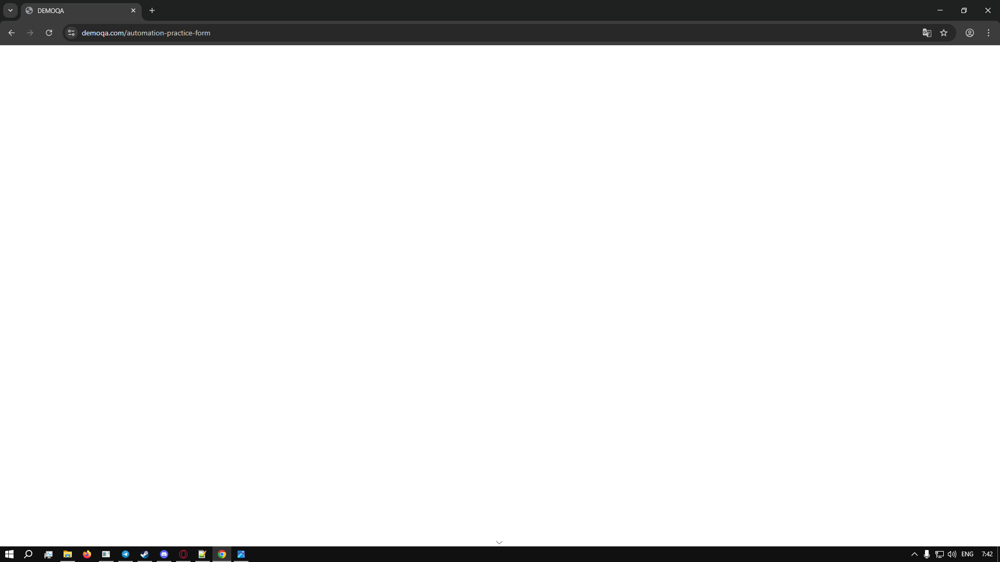

````markdown
# [High] Белый экран при очистке поля даты
**Окружение:** Google Chrome v138.0.7204.169 , Windows 10
**Шаги воспроизведения:**  
1. Открыть [Practice Form](https://demoqa.com/automation-practice-form)  
2. Кликнуть в поле "Date of Birth"  
3. Выделить текст 
4. Нажать Backspace  
**ОР:** Поле очищается, можно ввести новую дату  
**ФР:** Весь экран становится белым  
**Скриншот:**  

````
