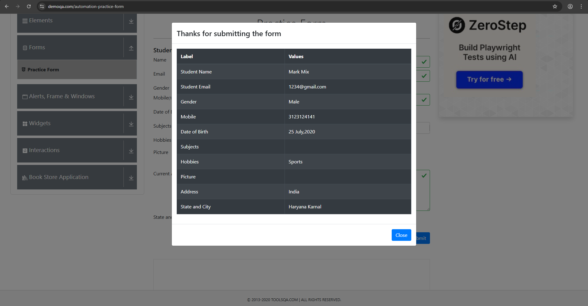

````markdown
# Тест-кейс: Базовое заполнение формы
**ID:** TC-DEMOQA-001  
**Приоритет:** Высокий (P1)  
## Шаги
| # | Действие | Ожидаемый результат |
|---|----------|---------------------|
| 1 | Открыть [Practice Form](https://demoqa.com/automation-practice-form) | Страница загружена |
| 2 | Заполнить поля:<br>- First Name: `Mark`<br>- Last Name: `Mix`<br>- Gender: `Male`<br>- Mobile: `3123124141` | Данные отображаются |
| 3 | Нажать `Submit` | Появляется модальное окно |
## Фактический результат
✅ Модальное окно появилось с корректными данными  
**Окружение:** Windows 10, Chrome v138.0.7204.169  
**Скриншот:**  

````
